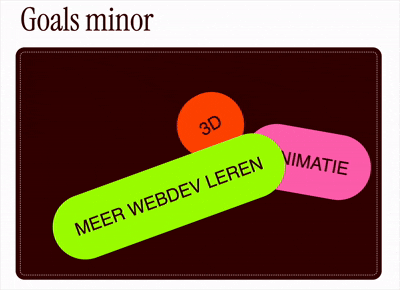

# sprint 0

## Workshop van Cyd
4.2.2026

- View transitions met 
```startViewTransition```
startViewTransition kan worden gebruikt om een transition/animatie te maken op dezelfde pagina of tussen 2 pagina's.

View transitions maken een snapshot van de oude en nieuwe staat van een website en animeren tussen deze om zo een transtion te maken.

- Scroll-driven animations met 
```animation-timeline: view();```
animation-timeline kan worden gebruikt om animaties een tijdlijn te geven tijdens het scrollen.
<b>MDN Docs</b>
``` The animation-timeline property can be used to set a named or anonymous scroll progress or view progress timeline. Alternatively, it can be used to explicitly set the default time-based document timeline to control the progress of an element's animation or to have no timeline at all, in which case the element does not animate. ```

## Weekly nerd - Kilian Valkhof
- Gebruik minder sterke talen het meest

## log
dag 1 - 3.2.26
Kick-off en de opdracht van de minor

dag 2 - 4.2.26
Workshop van Cyd over scr`oll animations en same page transitions, weekly nerd van Kilian Valkhof. Verder animaties aan de foto grid toegevoegd en meer styling gedaan voor de site

### Week 1
Deze week heb ik:
- Het design van de website gemaakt
- Er is nu een live linkje naar de website.
- basis html/css van de website opgezet.
- de mobile versie van de website is af

[Deze](https://dev.to/pwnkdm/fun-with-javascript-changing-page-titles-dynamically-2gcg) code gebruikt om de pagina titel te veranderen als je de website verlaat:

```
document.addEventListener("visibilitychange", function () {
   if (document.hidden) {
		document.title = "Kom terug!!!!!";
   } else {
		document.title = originalTitle;
   }
  });
  ```

dag 3 - 9.2.26
Extra eis, gewerkt aan een theme toevoegen en meer mensen fetchen uit de FDND api.
Deze keer hebben we een forEach gebruikt om over alle mensen heen te lopen.

dag 4 - 11.2.26
Code review -> laatste loodjes
Met Romy heb ik de review gedaan, over het algemeen zag haar code er prima uit en ze voldoet aan de [code conventies] (https://docs.fdnd.nl/conventies.html#code-conventies).

Met Matthew heb ik de checkout gedaan

dag 5 - 12.2.26
Werk opleveren

### Week 2
Er zijn themas op de website.



Z-index op de leerdoelen ziet er niet uit dus die heb ik weggehaald

van
```
@keyframes move {
    from {
        top: 15%;
        z-index: 0;
    }
    to {
        z-index: 4;
       top: 55%;
    }
}
```
naar 
```
@keyframes move {
    from {
        top: 15%;
    }
    to {
       top: 55%;
    }
}
```

Filter voor de api data werkt nu

```
async function fetchEveryone()
{
	const btns = document.querySelectorAll("button");

	btns.forEach((btn) => {
		btn.addEventListener("click", (e) => {
			btns.forEach(btn => btn.classList.remove("on"));
			btn.classList.add("on");
			if (btn.id == "alle")
			{
				fetcher("/person?filter[squads][squad_id][tribe][name]=CMD%20Minor%20Web%20Dev&filter[squads][squad_id][cohort]=2526&filter[fav_animal][_nempty]");
			}
			else
			{
				fetcher(`/person?filter[squads][squad_id][tribe][name]=CMD%20Minor%20Web%20Dev&filter[squads][squad_id][cohort]=2526&filter[fav_animal]=${btn.id}`);
			}
		});
	});
}
```
### Reflectie
Ik heb geleerd hoe je data uit een api fetched en hoe je animaties kan vmaken die afspelen als je er langs scrolt. Wat ik niet eerder wist is dat je in css kan nesten, ik dacht dat je dit alleen maar in sass kon doen. Voor de rest was de code wel logisch en duidelijk. In JS was de scope van dingen soms wel verwarend maar met wat hulp is het wel gelukt om dit werkend te krijgen.

### Resit

Omdat er niet echt een samenhangend thema was in de eerste site heb ik besloten om de site om te gooien en in de 2.0 echt een geheel te maken van het ontwerp + mijn intresses zodat als iemand die op de site komt echt kan zien dat de site van mij is.

#### Gedachte achter de site
Mijn interesses die ik wil laten samen komen voor de 2.0 site: 
- sterren
- 3d 
- sine waves (maar niet de wiskunde erachter)

Sterren en 3D zijn beide super cool. Dus ik ga dit combineren in een site over mezelf.

[Sterren](https://en.wikipedia.org/wiki/Star_cluster) kunnen in clusters vormen.
Dus de theme switch is best vanzelf sprekend, er is een sterren cluster die je aan en uit kan toggen zodat de sterren stoppen met bewegen.


3d code inspo: [voorbeeld van sanne](https://codepen.io/shooft/pen/RNRqrjM)

dit stukje aangepast naar [dit] om de 3d animatie anders te maken (https://codepen.io/alishasoedamah/pen/EayBpja)

```
@keyframes draai {
	0% {
		transform:
			rotateY(0turn)
            // hier een rotateX
			rotateX(1turn)
			translateZ( calc(var(--size) * 1.3) )
	}
	100% {
		transform:
			rotateY(1turn)
            // hier een rotateX
			rotateX(0turn)
			translateZ( calc(var(--size) * 1.3) )
	}
}
```

### Werk bespreken/feedback verwerken
#### naam 1
feedback
ideeën

#### 2
feedback
ideeën

verbeteringen


animation-timeline:
[MDN DOCS](https://developer.mozilla.org/en-US/docs/Web/CSS/Reference/Properties/animation-timeline#:~:text=view%20progress%20timeline-,The%20animation%2Dtimeline%20property%20of%20the%20element%20to%20animate%20is,of%20its%20nearest%20parent%20scroller.&text=All%20animation%20timelines%20can%20be%20removed%20by%20selecting%20a%20value%20of%20none%20.)
Title change on page change: https://dev.to/pwnkdm/fun-with-javascript-changing-page-titles-dynamically-2gcg
Voor de hover over de film container: https://www.w3schools.com/howto/howto_css_display_element_hover.asp
Animaties voor de imgs van de dieren: https://cydstumpel.github.io/minor-web-sprint-0/#/2
Theme switch: https://codepen.io/shooft/pen/QwEBNVx
https://medium.com/@ilearnbydoing/display-current-year-in-website-footer-e3f974a9dbc8

-- filter maken
button: https://dev.to/nicm42/multiple-buttons-looking-like-theyre-staying-pressed-one-at-a-time-4bbb
